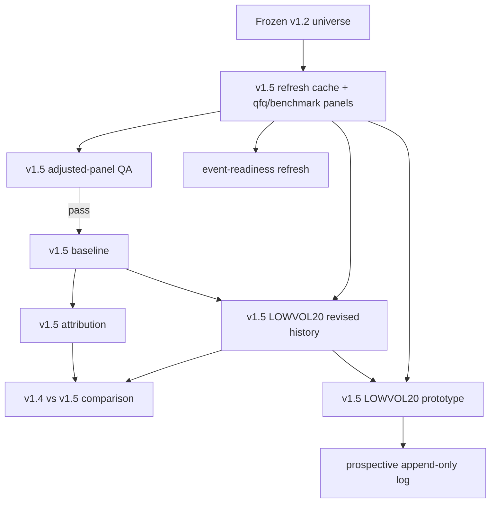

# v1.5 Pre-Refresh Lineage Audit

## Stage metadata

- status: completed
- inputs: current repository source, versioned v1.2/MOM60 v1.3/LOWVOL20 v1.4 artifacts, and `git status --porcelain`
- outputs: `reports/v1_5_pre_refresh_lineage_audit.md`; `reports/v1_5_frozen_file_manifest_before.csv`
- changed_files: these two outputs only
- commands: read-only `git`, `rg`, `Get-Content`, `Import-Csv`, and `Get-FileHash`; one manifest export
- exit_codes: 0 for completed audit commands; no production writer or network-fetch command was invoked
- QA summary: 56 unique frozen research codes found; manifest contains 162 SHA-256 records; no frozen-file comparison is applicable until a later post-refresh snapshot
- blockers: none for this audit; the worktree is already dirty and must not be used as evidence of a clean repository
- recommendation: create v1.5-only paths and run all writers serially in the order below; do not run `scripts/run_research.py` for this lineage

## Scope and frozen snapshot

The manifest is an inclusive source-and-artifact snapshot: every path under `data`, `reports`, `scripts`, or `tests` matching `v1_2`/`v1.2`, `mom60.*v1_3`, or `lowvol20.*v1_4` at audit time, plus the three generic-named MOM60 outputs (`factor_data_readiness_v1_3.csv`, `factor_hypothesis_summary_v1_3.csv`, and `factor_research_qa_v1_3.csv`). This includes 54 v1.2 cache files, 15 processed outputs, 59 reports, 12 producer sources, 13 tests, and 9 stock-pool inputs/sources.

| family | paths |
|---|---:|
| v1.2 | 135 |
| MOM60 v1.3 | 13 |
| LOWVOL20 v1.4 | 14 |
| total | 162 |

Each row in `v1_5_frozen_file_manifest_before.csv` has repository-relative `path`, uppercase `sha256`, `family`, `kind`, and byte count. The manifest is the required before-refresh comparison baseline; its own path is intentionally excluded to avoid self-hashing.

## Frozen universe

`data/processed/backtest_universe_research_v1_2.csv` has 57 rows and 56 unique six-digit codes. The duplicate row does not create a second member. The unique frozen universe is:

`000063, 000681, 000901, 000938, 000977, 001208, 002015, 002044, 002049, 002065, 002131, 002212, 002230, 002236, 002279, 002315, 002361, 002373, 002396, 002410, 002446, 002544, 002558, 002757, 002792, 002881, 002929, 002935, 002987, 300002, 300017, 300033, 300047, 300058, 300101, 300113, 300133, 300170, 300182, 300339, 300348, 300378, 300413, 300454, 300458, 300496, 300627, 300629, 300634, 300674, 300857, 300996, 301050, 301110, 301165, 301171`.

## Actual lineage and producers

| stage | producer | reads | frozen outputs / contract |
|---|---|---|---|
| universe and legacy panel | `scripts/prepare_backtest_data_v1_2.py` | `data/stockPool/*_v1_2.csv`, legacy price cache | research/expanded universe and `backtest_price_panel_v1_2.csv` |
| formal price fetch | `scripts/fetch_formal_data_v1_2.py` | v1.2 universe and network | formal price, benchmark, calendar, and fetch-manifest v1.2 files |
| raw base and benchmarks | `scripts/build_hybrid_reusable_data_v1_2.py` | frozen universe, `data/cache/price`, optional network benchmark source | `raw_base_price_panel_v1_2.csv`, `hybrid_benchmark_panel_v1_2.csv`, `hybrid_data_manifest_v1_2.csv`, gaps/readiness reports |
| qfq enrichment | `scripts/enrich_qfq_slow_v1_2.py` | raw base, v1.2 qfq cache, optional Sina/Eastmoney fetch | qfq cache, qfq panel, adjusted panel, fetch manifest, failure/readiness reports |
| adjusted-panel QA | `scripts/build_adjusted_price_panel_QA_v1_2.py` | adjusted panel, qfq manifest, raw base, frozen universe | adjusted-panel QA Markdown, issue CSV, summary CSV |
| baseline | `scripts/run_adjusted_stock_pool_baseline_v1_2.py` | frozen universe, adjusted panel, hybrid benchmark | baseline periods, NAV, summary, QA, Markdown |
| attribution | `scripts/analyze_baseline_attribution_v1_2.py` | baseline periods/NAV, adjusted panel, universe, benchmark | five attribution CSVs and Markdown |
| MOM60 v1.3 | `scripts/test_mom60_hypothesis_v1_3.py` | v1.2 baseline periods, adjusted panel, universe, benchmark | MOM60 panel and factor readiness/IC/quantile/stability/hypothesis/QA/Markdown outputs |
| LOWVOL20 v1.4 | `scripts/test_lowvol20_hypothesis_v1_4.py` | same v1.2 baseline inputs; imports baseline `Boundary` and `evaluate_period` | LOWVOL20 panel and 10 report outputs; `reports/lowvol20_v1_4_freeze_review.md` records 46/46 passing tests |

The data fetchers are separate from factor calculations. `build_hybrid_reusable_data_v1_2.py` has `code6`, cache normalization, date clipping, benchmark normalization, and readiness helpers; `enrich_qfq_slow_v1_2.py` has qfq normalization/validation, alignment, cache loading, and adjusted-panel construction; the baseline owns the calendar, boundary, return, turnover, and metric primitives.

## Reuse and hardcoded-path assessment

Reusable pure or near-pure functions:

- Baseline: `code6`, `prepare_price_panel`, `prepare_benchmark_panel`, `common_calendar`, `rebalance_boundaries`, `equal_weights`, `evaluate_period`, `drifted_weights`, `turnover_from_drift`, and metric helpers.
- QFQ: `code6`, `normalize_qfq_frame`, `valid_qfq`, `symbol_coverage`, `build_adjusted_panel`, `alignment_warnings`, and `evaluate_readiness`.
- Factor runners: `market_calendar`, factor-panel builders, per-period evaluators, and summary helpers. LOWVOL20 already reuses baseline `Boundary` and `evaluate_period`.

Hardcoded versioned paths remain in every producer. The v1.2 baseline constants target `*_v1_2` inputs and outputs; qfq targets `data/cache/qfq_enrichment_v1_2`; MOM60 targets module-global v1.2/v1.3 paths; LOWVOL20 accepts a root but still writes fixed `*_v1_4` names. `scripts/run_research.py` calls `aq_factor_lab.cli`, dynamically fetches/uses its own cache and writes generic `data/processed/*.csv` and `reports/*.md`. It is not part of this lineage and must not be used for v1.5.

Thin versioned wrappers are feasible only after adding explicit input/output path injection to existing runners, or by composing their existing pure helpers in v1.5 scripts. A wrapper that calls the existing `main()`/`run_research()` unchanged is unsafe because it overwrites frozen paths. The minimal safe implementation is a v1.5 wrapper with a small path configuration and imported pure functions, not copied research logic.

## Current Git state

At audit time, `git status --porcelain` reported 180 dirty records: 12 staged records, 171 unstaged records (including staged-and-modified files), and 152 untracked records. The count includes the newly created manifest and excludes this Markdown report before it is added.

Tracked modifications include `README.md`; generic `data/processed/{backtest_metrics,backtest_warnings,correlations,coverage,factor_correlation,groups,ic,ic_summary,portfolio_experiment_metrics,walk_forward_metrics,yearly_ic}.csv`; generic reports; `test.py`; plus staged/new `scripts/smoke_test_data_layer.py`, `src/aq_factor_lab/data_layer/*`, and `tests/test_data_layer.py`. Untracked content includes the entire frozen v1.2/MOM60/LOWVOL20 lineage, `data/stockPool/`, project scripts/tests, thematic-data artifacts, and the two assigned v1.5 report outputs. No dirty-file ownership is inferred from status; nothing was reverted or modified.

## Write-conflict graph

Conflicts are direct whenever two writers share a cache directory, processed panel, report path, or frozen file. No stages above may write a frozen v1.2, MOM60 v1.3, or LOWVOL20 v1.4 path. The refresh writer exclusively owns `data/cache/qfq_refresh_v1_5/`, `data/cache/benchmark_refresh_v1_5/`, its three v1.5 panels, refresh manifests, and panel QA. Baseline, attribution, LOWVOL20, comparison, prototype, prospective, and event-readiness writers each need disjoint v1.5 output names.

## Required serial order

1. Freeze the v1.5 universe/protocol and compare this manifest before any data writer.
2. Run one v1.5 full-refresh writer for all 56 stocks and three indices; write only v1.5 caches, panels, manifests, and QA.
3. Gate on adjusted-panel QA and frozen-hash equality. Stop downstream data-dependent stages on a critical failure.
4. Run the v1.5 baseline, then attribution.
5. Run the v1.5 LOWVOL20 revised-history factor analysis, then the v1.4-v1.5 comparison.
6. Only after the preceding gate passes, run the LOWVOL20 prototype, prospective append-only artifact, and event-readiness refresh.
7. Re-hash all 162 manifest paths, compare path/hash pairs, then run the independent review and final summary.

MOM60 generic outputs are not a legal v1.5 destination. `scripts/run_research.py` is also excluded: it owns the dirty generic research output paths and can fetch data, so it would both violate the specified lineage and create write conflicts.
